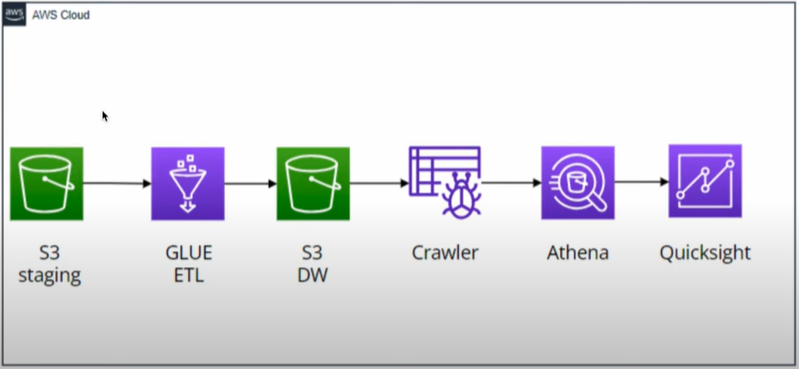
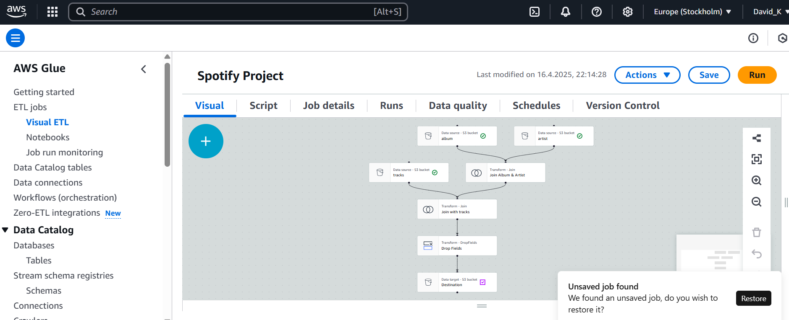
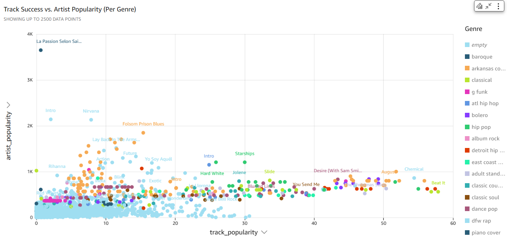

# 🎧 Spotify Data Pipeline with AWS

This project demonstrates a complete data pipeline for analyzing Spotify track data using the AWS data stack.

---

## 📌 Overview
We collect, transform, and visualize Spotify data using:
- **Amazon S3** (raw & cleaned data)
- **AWS Glue Studio** (ETL with joins & transformations)
- **Glue Crawler** (schema inference)
- **Amazon Athena** (SQL queries)
- **Amazon QuickSight** (dashboard visualization)

---

## 🗺️ Architecture

---

## 🧪 ETL with AWS Glue Studio

Data from multiple CSV files (track, album, artist) is joined and cleaned using Glue Studio's visual editor and PySpark code (auto-generated).

📷 **Visual Job Flow:**  

📜 **ETL Description:**  
→ [transform_spotify_description.md](glue_jobs/transform_spotify_description.md)

📜 **Generated PySpark Script:**  
→ [transform_spotify_etl.py](glue_jobs/transform_spotify_etl.py)

---

## 🧠 Athena SQL Queries

Query examples used for analysis (located in `athena_queries/`):
- `hit_score_insights.sql` – Calculates hit score distribution by popularity
- `popularity_needs.sql` – Tracks needing more exposure
- `genre_ranked_hits.sql` – Top genres by hit score

---

## 📊 Dashboard Output

QuickSight visualizes the final data — popularity trends, genre comparisons, hit distribution.

## 📊 Dashboard Output

QuickSight visualizes the final data — popularity trends, genre comparisons, hit distribution.

---

## 🔁 Data Flow Summary

1. Upload raw CSV files to `s3://project-soptify-datewithdata/staging/`
2. Run Glue Job (ETL) to transform and join the datasets
3. Store cleaned data in `s3://project-soptify-datewithdata/datawarehouse/`
4. Use Crawler to update the Glue Catalog
5. Query with Athena
6. Visualize in QuickSight

---

## 🔧 Tools Used

| Tool        | Purpose                    |
|-------------|-----------------------------|
| S3          | Storage (raw + warehouse)   |
| Glue Studio | No-code ETL + PySpark job   |
| Athena      | SQL querying over S3        |
| QuickSight  | BI and dashboarding         |
| PySpark     | Backend logic (generated)   |
